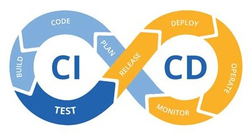

# CI/CD: fichier Python, linting et tests unitaires


Le projet implante la première partie (CI ou Continuous Integration) d'un processus CI/CD en Python.



## Mise en place et structure

1. Cloner le repo sur son ordinateur.
1. Le projet fonctionne en Python 3.11.
1. Installer les modules du fichier 'requirements.txt'. Ce fichier est à la racine du projet.

### Organisation du répertoire

Le projet utilise une structure pour séparer le code source des tests unitaires avec le module pytest.

```
───cicd_python_linting_pytest
    ├── .github
    │   └── workflows
    ├── img
    ├── models
    └── tests
```

- Tester manuellement le processus localement avant d'automatiser le processus sur avec Git et GitHub (dans le repo, à l'onglet Actions, Workflows).
- Le code source ('models/defi3.py') n'a qu'une fonction pour calculer la valeur d'un mot, selon la valeur des lettres du Scrabble.
	- Ce projet n'est qu'un cas de figure. Pour chaque morceau du code source, comme une fonction, il peut exister un ou plusieurs tests.
	- Un code source avec plusieurs classes, constructeurs d'instance, fonctions de classe, fonction d'instance (méthodes), etc. comporte nécessairement beaucoup de tests.
- Le code source de test ('tests/test_defi3.py') contient les tests unitaires avec le module pytest.
	- Avec Python 3.10+, il vaut mieux utiliser pytest : plus moderne que nose, nose2 et unittest, plus large communauté, capable de faire des tests d'intégration.
	- Les modules nose et nose2 bonifiaient le module unittest.
- Le CI est automatisé par le YAML '.github/workflows/ci-build.yaml' qui déclenche le processus CI/CD sur GitHub (dans le repo, à l'onglet Actions, Workflows).
	- Le fonctionnement des containers comme Docker est similaire.
- Il n'y a pas la deuxième partie (CD ou Continuous Deployment) du processus CI/CD, car le projet ne se prête pas à un déploiement comme un site web ou une application mobile, par exemple.
	- C'est ce que tout concepteur recherche : automatiser la séquence de travail, de la conception jusqu'au déploiement d'une nouvelle version du projet.
	- Il y a beaucoup de diversité avec les processus CI/CD. Ce cas de figure se limite au CI, par exemple.
	- Les grands services comme Gitlab, Bitbucket ou un service sur les plateformes de services cloud (AWS, Azure, GC, Alibaba Cloud, IMB Cloud, Tencent Cloud, Red Hat OpenShift, etc.) ont l'équivalent de l'onglet Actions (Workflows) et un YAML pilote un processus. 
-  `git push -u origin main` ou `git push` déclenche le processus CI/CD sur GitHub (Workflows).
- Sur GitHub, explorer l'onglet Actions (Workflows) suivant le déclenchement (`git push`).
- Est-ce que le processus a abouti ? Sinon, le processus a attrapé une erreur. L'automatisation évite une inspection fastidieuse même si sa mise en place est fastidieuse. À long terme, l'automatisation fait gagner du temps.

### YAML 'ci-build.yaml'

- Nommer (`name`) le CI : CI Build.
- Démarrer (`on`) le CI :
	- Les actions qui déclenchent le processus (Workflows) :
		- `git push -u origin main`.
		- `pull request` suivi d'un `merge` avec la branche 'main'.
	- Consulter les actions: https://docs.github.com/en/actions
	- Consulter les actions: https://github.com/actions
	- Les déclencheurs sont les actions que peut faire Git ou le service web (comme GitHub). Ce qui inclut même les billets (dans le repo, l'onglet Issues). Dans le cas des billets, processus peut lancer des actions : sort, label, assign, etc.
- Exécuter les tâches (`jobs`) :
	- Construire (`build`) la machine virtuelle ou le VM Ubuntu pour exécuter (`run-on`) la suite.
	- Construire (`build`) l'environnement virtuel Python.
	- Compléter les étapes (`steps`) :
		- `actions/checkout@v3`
			- https://github.com/actions/checkout, action.yml.
		- Installer les modules Python et les dépendances.
		- Exécuter le linting avec le module flake8 uniquement.
		- Exécuter les tests unitaires avec le module pytest.
	- Il n'y a pas d'étapes pour déployer (CD).

### Linting

- Avant de déclencher le CI sur GitHub (Workflows), tester le linting localement avec les modules flake8 et Pylint.
- `flake8 code.py`, `python -m flake8 code.py` ou commandes similaires, selon le système d'exploitation. Sur GitHub, le VM est Ubuntu (Linux) dont les commandes sont similaires à Mac OS X. Sous Windows, les commandes sont différentes.
- Consulter :
	- https://pypi.org/project/flake8/
	- https://www.flake8rules.com/
	- https://flake8.pycqa.org/en/latest/index.html
	- https://michaelcurrin.github.io/dev-cheatsheets/cheatsheets/python/linting/flake8.html
- `pylint code.py`, `python -m pylint code.py` ou commandes similaires selon le système d'exploitation.
- Consulter :
	- https://pypi.org/project/pylint/
	- https://michaelcurrin.github.io/dev-cheatsheets/cheatsheets/python/linting/pylint.html
- Avec le CI sur GitHub (Workflows), le linting automatisé ne lance que flake8.

### Tests unitaires

- Avant de déclencher le CI sur GitHub (Workflows), tester les tests unitaires localement avec le module pytest.
- `pytest -v` à la racine du répertoire du projet pour que pytest découvre le dossier 'tests' et les fichiers de tests.
- `pytest -v --cov=models` ou `pytest --cov=models tests/` ajoute la couverture des tests.
- `pytest -v --cov=models --cov-report=html` ajoute la couverture des tests et produit un report de couverture des tests.
- Consulter :
	- https://pypi.org/project/pytest/
	- Attention à la façon de nommer les dossiers, les fichiers, les fonctions de test dans les fichiers.
- Avec le CI sur GitHub (Workflows), les tests unitaires sont automatisés.
